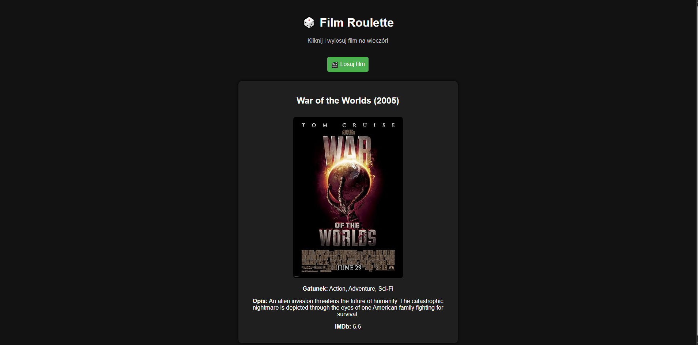

# FilmRoulette

FilmRoulette to prosta aplikacja webowa, która losuje film na wieczór z bazy OMDB.  
Kliknij przycisk **Losuj film**, a aplikacja wybierze losowy tytuł i wyświetli jego opis, plakat oraz ocenę IMDb.

## Zrzuty ekranu

## Funkcje

- Losowanie filmu z OMDB na podstawie popularnych słów kluczowych
- Wyświetlanie plakatu, opisu, gatunku i oceny IMDb
- Prosty, ciemny interfejs

## Jak uruchomić?

1. Sklonuj repozytorium lub pobierz pliki.
2. Otwórz plik `index.html` w przeglądarce.
3. Kliknij **Losuj film** i ciesz się propozycją na wieczór!

## Wymagania

- Przeglądarka internetowa
- Dostęp do internetu (do komunikacji z OMDB API)

## Konfiguracja

Jeśli chcesz użyć własnego klucza OMDB, podmień wartość `API_KEY` w pliku `app.js` na swój klucz z [omdbapi.com](https://www.omdbapi.com/apikey.aspx).